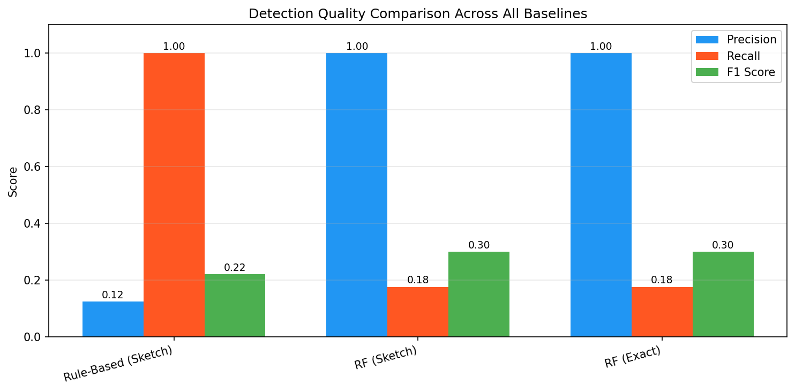
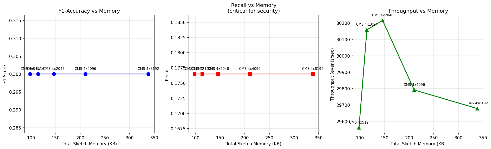

# Data Streaming Algorithms

Two projects exploring **data streaming algorithms** — probabilistic data structures that process massive data streams in a single pass using sublinear memory.

## Projects

### 1. [Streaming Algorithm Analysis](streaming-algorithm-analysis/)

Empirical analysis of two fundamental streaming algorithms with theoretical guarantee verification.

**Algorithms implemented:**

| Algorithm | Estimates | Versions |
|-----------|-----------|----------|
| **Flajolet-Martin (FM)** | F₀ (distinct element count) | Alpha, Beta, Final (median-of-means) |
| **Count-Min Sketch (CMS)** | Point frequency queries | Parameterized by width (w) and depth (d) |

**Key results:**
- FM Beta reduces normalized variance as O(1/s), matching theory
- FM Final achieves exponential tail concentration via the median trick
- CMS error scales as O(1/w) with failure probability O(2^(-d))
- All empirical results fall within theoretical (ε, δ)-bounds at 95% confidence

**Experiments:** 100 repetitions across 10 sketch sizes on a 200K-element Zipf-distributed stream, measuring accuracy, bias, and normalized variance.

### 2. [Streaming Attack Detection](streaming-attack-detection/)

Real-time network attack detection using sketch-based feature extraction on the [UNSW-NB15](https://research.unsw.edu.au/projects/unsw-nb15-dataset) dataset (~2.5M network flow records).

**Sketch data structures used:**
- **Morris Counter** — approximate F₁ (stream volume)
- **Flajolet-Martin** — distinct element count (F₀) for srcIP, dstIP, dstPort
- **AMS (Alon-Matias-Szegedy)** — F₂ frequency moment for burst detection
- **Count-Min Sketch** — heavy-hitter identification
- **Count-Sketch** — unbiased frequency estimation

**Pipeline:** Stream → 30s tumbling windows → sketch-based features → Random Forest / Gradient Boosting classifiers

**Key results:**
- **F1 = 0.90** with only **146 KB** of sketch memory per window (vs F1 = 0.92 exact baseline requiring unbounded memory)
- ~33,000 events/sec throughput on CPU
- CMS width has negligible impact beyond 512 columns — classifier accuracy is bounded by FM estimator noise




## Repository Structure

```
├── streaming-algorithm-analysis/
│   └── fm_and_cms_analysis.ipynb         # FM + CMS experiments with interactive plots
│
├── streaming-attack-detection/
│   ├── attack_detection_with_sketches.ipynb  # Full pipeline notebook
│   ├── attack_detection_databricks.py        # GPU-optimized Databricks version
│   ├── conclusions.md                        # Detailed findings
│   ├── confusion_matrices.png
│   ├── detection_comparison.png
│   └── memory_tradeoffs.png
│
└── data/                                 # Not tracked (see Data section below)
    └── UNSW_NB15/
```

## Data

The attack detection project uses the **UNSW-NB15 dataset** (~600 MB). It is not included in this repository.

To reproduce results:
1. Download from [UNSW Research](https://research.unsw.edu.au/projects/unsw-nb15-dataset)
2. Place CSV files in `data/UNSW_NB15/`

The streaming algorithm analysis uses synthetic data (Zipf distribution) generated in-notebook — no external data required.

## Requirements

```
numpy
pandas
matplotlib
plotly
scipy
scikit-learn
```

## Reproducibility

Both notebooks use `RANDOM_SEED = 42` for full reproducibility. All experiments are deterministic given the same seed.

---

<!-- demo-lab:start -->
## Explore this project

[Project page & walkthrough](https://eforus-overseer.github.io/demo-lab/projects/streaming-attack-detection/) — Try an interactive explanation and inspect the original source and results. Browser teaching examples are distinguished from trained models.
<!-- demo-lab:end -->
